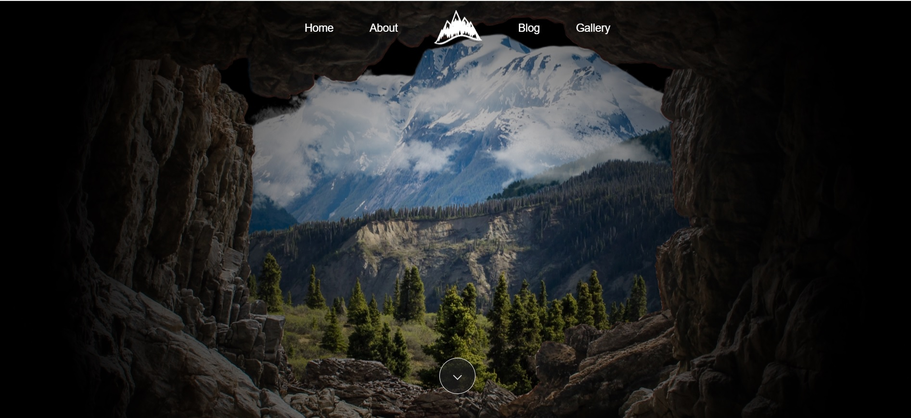

# 🏔 Mountains Blog

A visually rich blog with parallax effect, fog loader animation and page transitions. Built with **React**, **Vite**, and **CSS**.

---

## 🚀 Features

- Parallax effect on the homepage
- Smooth fog loader animation between routes
- Page transitions
- Responsive design (desktop / tablet / mobile)
- Dynamic routing with React Router
- Custom image layers for design depth

---

## 🛠 Tech Stack

- React + Vite
- CSS / SCSS
- React Router
- GitHub Pages (for deployment)

---

## 🖼 Preview



---

## 📦 How to Run Locally

```bash
git clone https://github.com/kozlovoleksii/mountains-blog.git
cd mountains-blog
npm install
npm run dev
